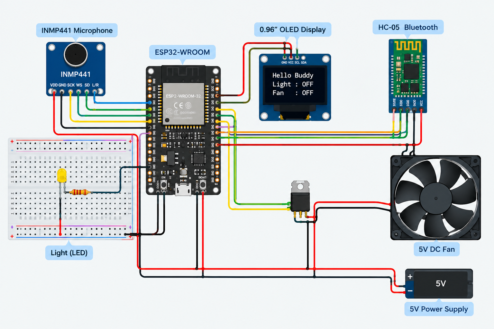

**HELLO BUDDY \- AN OFFLINE TINYML WAKE-WORD DETECTION SYSTEM**

**Problem Statement:** Wake Word Detection Using Low-Powered Microcontroller  
**Platform:** ESP32-WROOM  
**Core Technologies:** TinyML, MFCC, I2S Audio Processing

## **Abstract**

This project presents an offline voice-controlled smart room system based on the ESP32-WROOM microcontroller. The system uses an INMP441 I2S MEMS microphone to capture voice commands and applies MFCC-based feature extraction with a lightweight TinyML model for speech classification. The detected commands are processed locally on the ESP32 to control room appliances such as a light and a fan.

Unlike conventional cloud-based voice assistants, the proposed system does not require continuous internet connectivity or cloud processing for voice recognition. An OLED display provides system status, while Bluetooth can provide an alternative method of appliance control. The project demonstrates the feasibility of deploying voice intelligence on a resource-constrained embedded platform.

---

# **Problem Statement**

Traditional voice-controlled systems commonly depend on cloud servers for speech processing. This introduces internet dependency, communication delay and privacy concerns.

Low-powered microcontrollers also have limited memory and computational resources, making real-time speech recognition challenging.

Therefore, the problem addressed by this project is:

> **To develop a lightweight wake-word and voice-command detection system capable of operating locally on a low-powered microcontroller without relying on cloud processing.**

---

#  **Objectives**

* Develop an offline voice-controlled embedded system.  
* Implement wake-word detection using TinyML.  
* Extract useful speech characteristics using MFCC.  
* Deploy the trained model on ESP32-WROOM.  
* Control a light and fan using recognized commands.  
* Provide real-time status through an OLED display.  
* Reduce dependence on cloud-based voice processing.  
* Develop a low-cost and scalable embedded AI solution.

---

# The proposed system combines an INMP441 microphone, ESP32-WROOM and a TinyML speech-classification model.

The microphone captures the user's voice and provides digital audio to the ESP32 through the I2S interface. The audio is processed to extract MFCC features, which are supplied to the trained TinyML model. The model identifies the corresponding command and the ESP32 performs the required control action.

The system supports commands such as:

* Hello Buddy  
* Light ON  
* Light OFF  
* Fan ON  
* Fan OFF  
* Unknown / Noise

---

# **System Architecture**

### **Voice Processing Path**

**User Voice**  
 ↓  
 **INMP441 Microphone**  
 ↓  
 **Audio Preprocessing**  
 ↓  
 **MFCC Feature Extraction**  
 ↓  
 **TinyML Classification Model**  
 ↓  
 **ESP32-WROOM**  
 ↓  
 **Light / Fan / OLED**

### **Alternative Control Path**

**Mobile Device**  
 ↓  
 **HC-05 Bluetooth**  
 ↓  
 **ESP32-WROOM**  
 ↓  
 **Light / Fan**

---

# **Hardware Requirements**

| Component | Purpose |
| ----- | ----- |
| ESP32-WROOM | Main processing and control unit |
| INMP441 | Digital voice/audio capture |
| 0.96" OLED | System status display |
| LED/Light | Lighting output |
| 5V DC Fan | Fan output |
| Fan Driver | Controls fan safely from ESP32 |
| HC-05 | Alternative Bluetooth control |

---

# **Software Requirements**

* Arduino IDE  
* ESP32 Board Package  
* C/C++  
* Edge Impulse  
* TinyML model  
* MFCC feature extraction  
* I2S audio interface  
* Adafruit SSD1306 library  
* Adafruit GFX library

---

# **Working** 

---

# **TinyML Model**

The voice dataset contains samples corresponding to the required voice commands.

### **Model Classes**

* hello\_buddy  
* light\_on  
* light\_off  
* fan\_on  
* fan\_off  
* unknown/noise

The audio samples are processed using MFCC features before being provided to the machine-learning classifier.

The trained model is deployed to the ESP32 as an embedded inference library.

---

# **MFCC Feature Extraction**

Mel-Frequency Cepstral Coefficients are used to represent important characteristics of human speech.

The general processing flow is:

**Audio Signal → Framing → Frequency Analysis → Mel Filter Bank → MFCC Features**

MFCC reduces the raw audio information into a compact representation that can be efficiently processed by a lightweight machine-learning model.

---

# **Implementation**

The ESP32 acts as the central controller of the system.

It performs:

* I2S microphone data acquisition  
* Audio preprocessing  
* TinyML inference  
* Command classification  
* Appliance control  
* OLED status updates  
* Bluetooth communication

The system is designed so that voice processing and decision-making take place locally on the embedded device.

---

# **Results**

### **Current Prototype Results**

* INMP441 voice capture implemented.  
* TinyML model trained and tested.  
* Voice-command classification implemented.  
* Light control implemented.  
* Fan control implemented.  
* OLED status display implemented.  
* Bluetooth alternative control implemented.  
* Embedded prototype demonstrated successfully.

### **Model Performance**

**Current test accuracy: 78.7%**

Further targeted dataset collection and training can be used to improve recognition robustness.

---

# **Advantages**

* Offline operation  
* No continuous cloud dependency  
* Low-cost hardware  
* Real-time embedded processing  
* Improved privacy  
* Compact implementation  
* Scalable architecture  
* Multiple control methods

---

# **Applications**

The proposed architecture can be extended to:

* Smart home automation  
* Educational embedded-AI systems  
* Assistive technology  
* Offline voice interfaces  
* Industrial control systems  
* Low-connectivity environments

---

# **Limitations**

* Recognition accuracy depends on the quality and diversity of the training dataset.  
* Background noise can affect voice classification.  
* ESP32 has limited computational and memory resources compared with larger AI platforms.  
* The current prototype supports a limited number of predefined commands.

---

# **Future Scope**

Future development can include:

* Improved noise robustness  
* Larger and more diverse datasets  
* Multiple wake words  
* Personalized voice recognition  
* More appliance-control commands  
* Lower-power listening modes  
* Additional embedded AI models  
* Integration with more real-world devices

---

# **Conclusion**

The project demonstrates the implementation of an offline TinyML voice-control system using an ESP32-WROOM microcontroller. By combining INMP441 audio capture, MFCC feature extraction and lightweight machine learning, voice commands can be processed locally without depending on cloud services.

The working prototype demonstrates the potential of **Edge AI for low-cost, privacy-focused and real-time voice interaction on resource-constrained embedded devices.**

